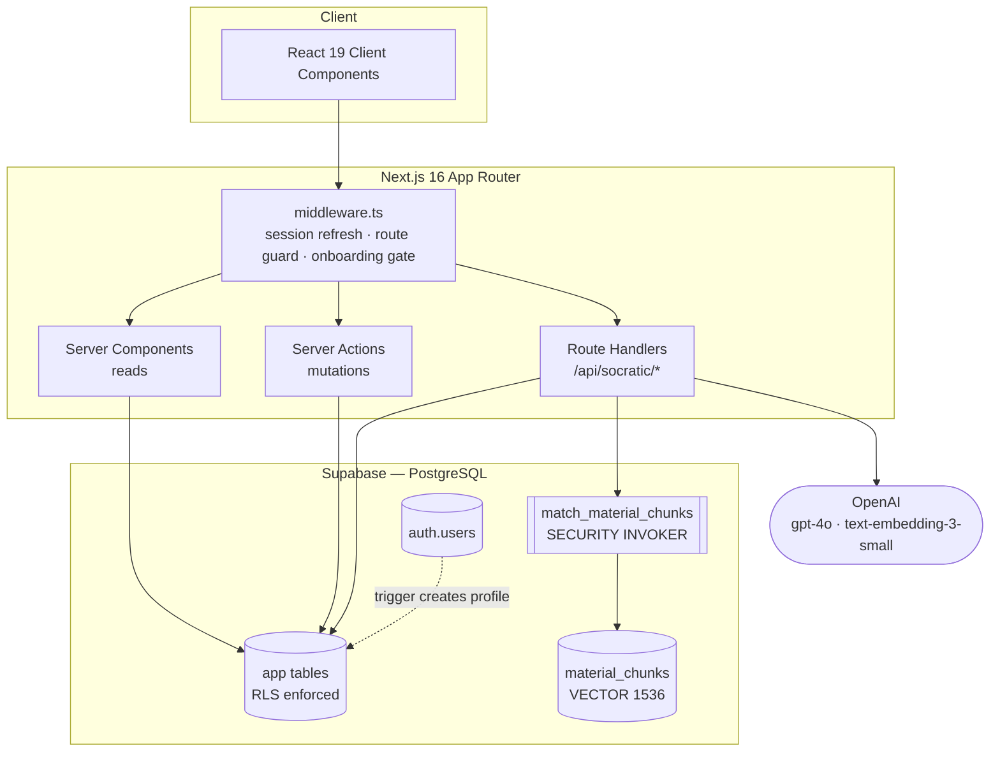
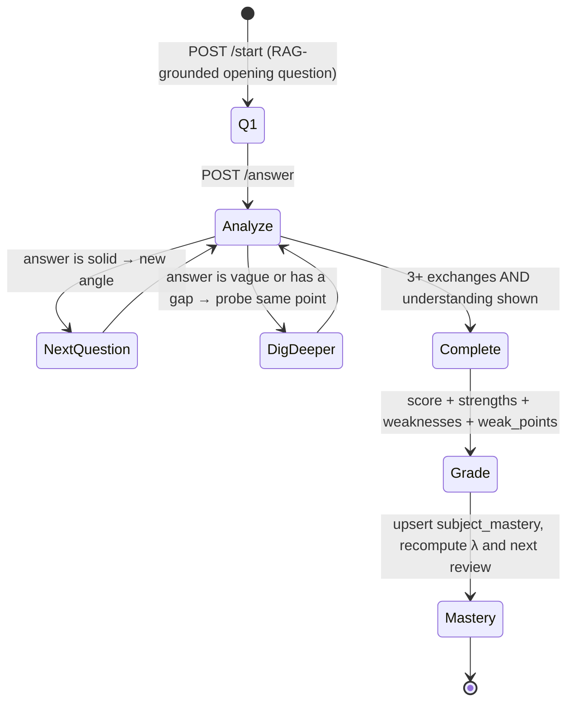
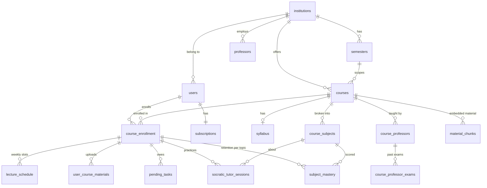

# StudyFlow

**An AI study platform that replaces re-reading with active recall — and knows *when* you're about to forget.**

StudyFlow turns a student's own course material (syllabi, lecture notes, past exams) into an adaptive
Socratic tutoring loop, then models the decay of what they learned so it can schedule the next review
before the knowledge is gone.

Built for engineering students at Bar-Ilan University as the first target institution. Full-stack
TypeScript: Next.js 16 App Router, Supabase (PostgreSQL + pgvector + RLS), OpenAI.

```
Course material ──▶ chunk + embed ──▶ pgvector ──▶ RAG retrieval ──▶ Socratic question
                                                          ▲                    │
                                                          │                    ▼
                                        knowledge profile ◀── mastery + decay ◀── graded session
```

---

## Table of Contents

- [Why this project](#why-this-project)
- [Feature status](#feature-status-honest-version)
- [Tech stack](#tech-stack)
- [Getting started](#getting-started)
- [Repository structure](#repository-structure)
- [Architecture](#architecture)
- [The algorithmic thinking](#the-algorithmic-thinking)
  - [1. Memory as a decaying battery](#1-memory-as-a-decaying-battery-ebbinghaus)
  - [2. The adaptive Socratic loop](#2-the-adaptive-socratic-loop)
  - [3. The knowledge profile](#3-the-knowledge-profile-what-the-tutor-remembers-about-you)
  - [4. RAG: grounding, freshness, and tenancy](#4-rag-grounding-freshness-and-tenancy)
  - [5. Security model: RLS-first](#5-security-model-rls-first)
  - [6. Failure philosophy](#6-failure-philosophy-degrade-never-crash)
- [Data model](#data-model)
- [API reference](#api-reference)
- [Design decisions & trade-offs](#design-decisions--trade-offs)
- [Roadmap — what's not built yet](#roadmap--whats-not-built-yet)
- [Known limitations](#known-limitations)

---

## Why this project

Students re-read notes because it *feels* productive. It isn't — recognition is not recall. The two
interventions with the strongest evidence behind them are **active recall** (retrieving an answer from
memory) and **spaced repetition** (retrieving it just before you'd forget it). Both are well known and
almost nobody does them, because doing them by hand means writing your own questions and running your
own review schedule.

StudyFlow automates both ends of that:

1. **The questions write themselves** — grounded in *your* course's material via RAG, so the tutor asks
   about the Pumping Lemma the way *your* syllabus framed it, not the way a generic LLM would.
2. **The schedule computes itself** — every graded session updates a per-topic mastery score and a decay
   rate, and the system knows how many days until that topic drops back into the red.

The tutor is deliberately **Socratic**: it never states the answer. It asks, evaluates, digs deeper where
the reasoning is thin, and only then grades. A student who is handed the answer learns nothing; a student
who is pushed to reconstruct it does.

---

## Feature status (honest version)

| Area | Status | Notes |
|---|---|---|
| Email/password auth + session middleware | ✅ Done | Supabase Auth, SSR cookie sessions, route protection |
| 3-step onboarding (institution → course → professor) | ✅ Done | State passed via URL search params, no client storage |
| Course enrollment CRUD + lecture schedule | ✅ Done | Add / edit / soft-delete, free-plan limit enforced |
| Dashboard (semester progress, course grid) | ✅ Done | Progress computed from real semester dates |
| Dashboard task queue | 🟡 Mock | UI built; `pending_tasks` generator not written yet |
| **Socratic tutor session engine** | ✅ Done | Adaptive question loop, hints, grading, mastery write-back |
| **RAG pipeline (chunk → embed → pgvector → retrieve)** | ✅ Done | Lazy, idempotent, tenancy-scoped |
| **Ebbinghaus mastery/decay model** | ✅ Done | Battery calc, decay banding, review scheduling |
| Subject battery API | ✅ Done | `/api/socratic/subjects` returns live battery per topic — not yet rendered in the UI |
| PDF upload + parsing | ❌ Not built | `parsed_text` is currently populated by seed data only |
| Homework review tab | 🟡 Placeholder | UI shipped with static sample feedback |
| Practice questions / past-exam tab | 🟡 Placeholder | UI shipped with static sample questions |
| Course analytics page | ❌ Not built | |
| Streaks, notifications, automation | ❌ Not built | Schema supports `streak_count`; no writer yet |
| Pro plan / billing | ❌ Not built | `subscriptions` table + free-tier gate exist; no payment |
| Automated tests | ❌ Not built | See [Roadmap](#roadmap--whats-not-built-yet) |

The interesting engineering lives in the ✅ rows — the RAG pipeline, the session state machine, and the
decay model. The 🟡 rows are UI shells built ahead of their backends so the flow could be designed first.

---

## Tech stack

| Layer | Choice | Why |
|---|---|---|
| Framework | **Next.js 16** (App Router) | Server Components fetch data with the user's own JWT — no API hop for reads |
| UI | **React 19 + Tailwind CSS 4** | Dark-mode-first design system, zero component-library weight |
| Language | **TypeScript 5** (strict) | Every DB row shape is typed in `lib/types.ts` |
| Database | **Supabase / PostgreSQL** | Row Level Security does the authorization, in the database |
| Vector search | **pgvector** | Embeddings live next to the relational data — one store, joinable, RLS-protected |
| AI | **OpenAI** `gpt-4o` + `text-embedding-3-small` | Structured output via forced tool-calls |
| Auth | **Supabase Auth** (`@supabase/ssr`) | Cookie-based sessions that work in middleware, RSC, and route handlers |

---

## Getting started

### Prerequisites

- Node.js 20+
- [Supabase CLI](https://supabase.com/docs/guides/cli) and Docker (for the local stack)
- An OpenAI API key

### 1. Install

```bash
git clone https://github.com/ofekrozen/StudyFlow.git
cd StudyFlow/studyflow
npm install
```

### 2. Start the local database

```bash
npx supabase start
```

This spins up Postgres on `54322`, the API gateway on `54321`, and Supabase Studio on
`http://127.0.0.1:54323`. It prints the local URL and keys — you need them next.

### 3. Configure environment

```bash
cp .env.example .env.local
```

```dotenv
NEXT_PUBLIC_SUPABASE_URL=http://127.0.0.1:54321
NEXT_PUBLIC_SUPABASE_ANON_KEY=<publishable key printed by supabase start>
SUPABASE_SERVICE_ROLE_KEY=<secret key — server-side only, never imported into client code>
OPENAI_API_KEY=sk-...
```

> The app itself only ever uses the **anon key plus the user's JWT**. Authorization is enforced by RLS
> policies in the database, not by the client's choice of key.

### 4. Apply migrations and seed

```bash
npx supabase db reset
```

`db reset` replays every migration in `supabase/migrations/` in order and then runs `supabase/seed.sql`,
which loads Bar-Ilan University, the Spring 2026 semester, 9 real courses with their Hebrew syllabi,
9 professors, per-course topic lists, and material types. All seed IDs are fixed UUID literals, so a
reset is deterministic and you can hard-code references while developing.

### 5. Run

```bash
npm run dev        # http://localhost:3000
npm run build      # production build
npm run lint       # eslint
```

Register a new account at `/register`. A database trigger creates the matching `public.users` and
`subscriptions` rows automatically, then you're routed into onboarding.

---

## Repository structure

```
StudyFlow/
├── GEMINI.md                        # Agent instructions (persona, guardrails, conventions)
└── studyflow/
    ├── app/
    │   ├── (auth)/                  # Login / register (route group — no app chrome)
    │   ├── actions/                 # Server Actions: auth, enrollment, course CRUD
    │   ├── api/
    │   │   ├── courses|institutions|semesters|professors|lectures|enrollment/
    │   │   └── socratic/            # ── the tutor engine ──
    │   │       ├── start/           #    open a session, generate question #1
    │   │       ├── answer/          #    grade an answer, decide the next move
    │   │       ├── hint/            #    one nudge per question, never the answer
    │   │       ├── subjects/        #    topics + live battery levels
    │   │       ├── session/[id]/    #    session transcript
    │   │       └── utils/
    │   │           ├── battery.ts           # Ebbinghaus decay math
    │   │           └── knowledgeProfile.ts  # per-topic learner model
    │   ├── auth/callback/           # OAuth code exchange
    │   ├── dashboard/               # Semester progress, task queue, course grid
    │   ├── onboarding/              # 3 steps: basics → schedule → syllabus
    │   └── practice/[enrollmentId]/ # Socratic | Homework | Practice tabs
    ├── components/
    │   ├── dashboard/               # CourseOverview, CourseModal (add/edit/unenroll)
    │   ├── layout/NavBar.tsx
    │   └── ui/                      # Button, Input, Select, StepProgress
    ├── lib/
    │   ├── ai-config.ts             # Models, temperatures, retrieval counts, chunk sizes
    │   ├── embeddings.ts            # Chunking, hashing, batched embedding
    │   ├── rag.ts                   # Ingestion + retrieval
    │   ├── openai.ts
    │   └── types.ts                 # Typed row shapes for every table
    ├── supabase/
    │   ├── migrations/              # 8 ordered migrations
    │   └── seed.sql                 # Bar-Ilan, Spring 2026, 9 courses + syllabi
    ├── utils/supabase/              # SSR client factories (browser / server / middleware)
    ├── middleware.ts                # Session refresh + route protection + onboarding gate
    └── docs/                        # PRD, DB_SCHEMA, CLAUDE.md
```

`trash/prisma/` is a deliberately kept graveyard: the project started on Prisma and moved to the Supabase
client so that **authorization could live in RLS rather than in application code**. See
[Design decisions](#design-decisions--trade-offs).

---

## Architecture



**Every path to the database carries the user's JWT.** Server Components, Server Actions, and route
handlers all build their Supabase client from the request's cookies, so `auth.uid()` is populated inside
Postgres and RLS policies apply uniformly. There is no privileged bypass in the request path.

---

## The algorithmic thinking

This is the part worth reading. Four systems interlock: a decay model, a session state machine, a learner
profile, and a retrieval pipeline.

### 1. Memory as a decaying battery (Ebbinghaus)

Each `(enrollment, subject)` pair carries a `mastery_score` (0–100) and a personal `decay_rate` λ. Current
retention is the Ebbinghaus forgetting curve:

```
battery(t) = mastery_score · e^(−λ · t)          t = days since last practice
```

Rendered as a battery with three states — 🟢 `>70`, 🟡 `40–70`, 🔴 `<40`.

**The insight is that λ is not a constant.** A concept you understood deeply decays slower than one you
barely grasped, so the decay rate is derived from the score itself:

| Score at end of session | λ | Half-life | Days until 🔴 (drop to 40) |
|---|---|---|---|
| ≥ 90 | 0.10 | ~6.9 d | 8 |
| ≥ 70 | 0.15 | ~4.6 d | 4 |
| ≥ 50 | 0.23 | ~3.0 d | 1 |
| < 50 | 0.35 | ~2.0 d | 0 |

This creates the right incentive gradient: a shaky topic goes red almost immediately and keeps nagging;
a mastered topic buys you a week of quiet. One good session genuinely changes your schedule.

Two closed-form solves fall out of the same curve, which is why the model was chosen over a rule table:

```
days until red   =  ln(mastery / 40) / λ          // when will this decay past the red line?
next review at   =  ln(score   / 70) / λ          // when will this drop out of green?
```

Both are exact inversions of the decay equation — no simulation loop, no lookup table, and the whole
model is four numbers per topic. `calculateBattery()` is a pure function of
`(score, λ, last_practiced_at)`, so retention is computed at read time and never needs a cron job to keep
rows fresh. A subject nobody has touched in three weeks is *already* correct in the database.

📄 [`app/api/socratic/utils/battery.ts`](studyflow/app/api/socratic/utils/battery.ts)

### 2. The adaptive Socratic loop

A session is not a fixed quiz. After every answer the model returns one of three actions, and the
conversation branches:



**Guardrails around the model's judgment.** An LLM asked "should we stop?" is a soft, drifty classifier,
so its decision is clamped by deterministic code:

- **Floor:** `COMPLETE` before 3 answers is rewritten to `DIG_DEEPER`. No student gets graded on one
  lucky sentence.
- **Ceiling:** at 5 answers, completion is forced regardless of what the model wanted. Sessions cannot
  run away, and cost per session is bounded.
- **Hints:** exactly one per question, tracked per-question in JSONB — a hint points at the *concept*,
  never the answer.
- **Rate limit:** more than 3 in-progress sessions for one enrollment within an hour returns `429`,
  which caps the blast radius of a runaway client on a paid API.

**Structured output, not prose parsing.** Every model call uses a forced tool-call with a `strict` JSON
schema (`generate_question`, `analyze_answer`, `generate_hint`, `generate_feedback`). The model cannot
reply with prose, so there is no regex extraction and no "sometimes it adds a preamble" class of bug.

**Temperature is split by task** ([`lib/ai-config.ts`](studyflow/lib/ai-config.ts)): `0.7` for
generation (questions and hints should vary between sessions) and `0.3` for judgment (grading and answer
analysis should be reproducible). Same model, two very different jobs.

**The whole transcript lives in JSONB** — `ai_questions`, `user_answers`, `ai_feedback`,
`covered_chunk_ids` — on one `socratic_tutor_sessions` row. A session is one atomic read and one atomic
update, the shape can evolve without a migration, and the full pedagogical history (including the model's
private `reason` for each branch) is preserved for later analysis.

📄 [`app/api/socratic/answer/route.ts`](studyflow/app/api/socratic/answer/route.ts)

### 3. The knowledge profile: what the tutor remembers about you

Before generating any question, the system assembles a per-topic learner model and injects it into the
prompt. This is what makes session #4 different from session #1.

```
buildKnowledgeProfile(enrollment, subject) → {
  masteryScore, currentBattery, batteryColor, daysSinceLastPractice,
  sessionHistorySummary,      // "- 3 days ago: score 62, weak points: [normalization, indexing]"
  recurringWeakPoints,        // labels tallied across the last 5 sessions, ranked
  difficultyBand              // foundational | intermediate | advanced
}
```

Three things happen with it:

1. **Difficulty calibration.** The band maps to an explicit instruction: *foundational* asks the student
   to reason through a core concept, *intermediate* asks them to apply it to a scenario, *advanced*
   probes edge cases and trade-offs. The same topic gets harder as you get better at it.
2. **Weak-point targeting.** At the end of every session the grader extracts short concept labels
   (1–4 words) into `weak_points`. Those are tallied across the last five sessions, and anything
   recurring is fed back in as *"the student has repeatedly struggled with these — prioritize probing
   them."* The system pursues your specific gaps, not the topic's average difficulty.
3. **Anti-repetition.** The opening questions of the last three completed sessions are passed in with an
   explicit "do not repeat or closely rephrase these" instruction, and within a session every
   already-asked question is listed. Without this, a temperature-0.7 model asked the same question about
   the same syllabus converges on the same phrasing every time.

📄 [`app/api/socratic/utils/knowledgeProfile.ts`](studyflow/app/api/socratic/utils/knowledgeProfile.ts)

### 4. RAG: grounding, freshness, and tenancy

A generic LLM knows automata theory. It does not know that *this* course covered Rice's theorem in week 9
and skipped space complexity. Every question, hint, and grade is therefore grounded in retrieved course
material, with a hard prompt constraint: *do not introduce external concepts, terminology, or frameworks
the student may not have encountered in this course.*

**Chunking — paragraph-packed with overlap.** Text is split on blank lines and whole paragraphs are packed
into ~2800-character buffers; each new chunk is seeded with the trailing 400 characters of the previous
one so a definition split across a boundary survives in both. Oversized paragraphs are hard-sliced as a
fallback. Char-based rather than token-based (~4 chars/token) — a deliberate call to avoid a tokenizer
dependency for prose, where the approximation costs nothing.

**Ingestion is lazy and idempotent.** There is no background worker. Before any retrieval,
`ensureCourseMaterialEmbedded()` runs — and its central trick is a **sha256 content hash** of each
source's `parsed_text`:

```
hash(parsed_text) == stored content_hash  →  skip entirely (zero OpenAI calls)
otherwise                                 →  delete this source's chunks, re-chunk, re-embed, insert
```

Re-embedding is therefore self-healing and free when nothing changed. Editing one document re-embeds
exactly that document. Embedding requests are batched 96 at a time and re-sorted by index defensively, so
ordering never silently corrupts the chunk-to-vector mapping.

**Retrieval is tenancy-scoped, twice.** Course material comes from three sources with two different
visibility rules:

| Source | `enrollment_id` | Visible to |
|---|---|---|
| `syllabus` | `NULL` | everyone enrolled in the course |
| `course_professor_exams` | `NULL` | everyone enrolled in the course |
| `user_course_materials` | set | **only that student** |

The `match_material_chunks` RPC filters on `enrollment_id IS NULL OR enrollment_id = p_enrollment_id`,
*and* it is declared `SECURITY INVOKER` so the table's RLS policy still applies to the caller inside the
function. Two independent mechanisms have to fail before one student's private notes could surface in
another student's tutoring session.

**Novelty via `covered_chunk_ids`.** Every chunk surfaced during a session is recorded on the session row
and passed to the next retrieval as `p_exclude_ids`. Follow-up questions are therefore pulled from
material the conversation *hasn't* touched yet — without this, cosine similarity keeps returning the same
top-k passages and the tutor circles one paragraph for five questions.

**The retrieval query changes with the phase of the conversation**, which is the point of doing RAG per
turn rather than once:

| Route | Query embedded | k |
|---|---|---|
| `/start` | subject name + description | 8 |
| `/answer` | the last question **+ the student's actual answer** | 6 |
| `/hint` | the question the student is stuck on | 5 |

Embedding the student's own words means retrieval follows the student's misconception, not the topic's
table of contents.

📄 [`lib/rag.ts`](studyflow/lib/rag.ts) · [`lib/embeddings.ts`](studyflow/lib/embeddings.ts) ·
[`migrations/…_material_chunks_pgvector.sql`](studyflow/supabase/migrations/20260715000000_material_chunks_pgvector.sql)

### 5. Security model: RLS-first

Authorization is a database concern here, not an application one.

- **Every table with user data has RLS enabled** and a policy that resolves ownership through
  `course_enrollment.user_id = auth.uid()`. A session, a mastery row, or a material chunk is reachable
  only by walking back to an enrollment the caller owns.
- **The frontend never sees the service-role key.** All clients are built from the anon key plus the
  request's JWT.
- **Profile creation is the one privileged operation**, and it is isolated in a `SECURITY DEFINER`
  trigger on `auth.users` that creates the `public.users` and `subscriptions` rows with
  `user_id = NEW.id`. Because the profile PK *is* the auth UID, every downstream `auth.uid()` policy
  works without a join.
- **Route handlers still verify ownership explicitly** before acting — belt and braces, and it produces a
  clean `404` instead of a confusing empty result when RLS filters a row away.
- **Tables without RLS get manual guards.** `lecture_schedule` has no policy, so
  [`/api/lectures`](studyflow/app/api/lectures/route.ts) verifies the enrollment belongs to the caller
  before returning anything — and says so in a comment, so the gap is documented rather than latent.

### 6. Failure philosophy: degrade, never crash

The tutor depends on two external systems that can fail independently (OpenAI, pgvector retrieval). Both
are wrapped so that failure degrades quality instead of breaking the session:

- `fetchRAGContext()` returns `[]` on **any** error — a failed embedding call, a bad RPC, a network blip.
- Callers branch on the empty result into an explicit *"no course materials available — restrict yourself
  to topics that clearly fall under the subject name"* prompt.

A student whose embeddings failed still gets a working (slightly more generic) tutoring session and never
sees a stack trace. Failures are logged with `console.warn` and course context, not swallowed silently.

---

## Data model

19 tables across five concerns. Every ID is a UUID; user- and course-facing rows use `deleted_at` soft
deletes so history survives an unenrollment.



| Group | Tables |
|---|---|
| Identity & billing | `users`, `subscriptions`, `institutions` |
| Academic structure | `semesters`, `courses`, `professors`, `course_professors`, `course_subjects` |
| Enrollment | `course_enrollment`, `lecture_schedule`, `lecture_enrollment` |
| Material & RAG | `syllabus`, `user_course_materials`, `material_types`, `course_professor_exams`, `material_chunks` |
| Learning | `socratic_tutor_sessions`, `subject_mastery`, `pending_tasks` |

**`course_subjects` is the unit of learning.** A course isn't tracked as one blob — it's decomposed into
atomic topics ("Pumping Lemma", "Turing machine equivalence"), and mastery, decay, and sessions all key on
a topic. That's what makes targeted review possible: you don't revise *Automata*, you revise the two
topics that went red.

Migrations, in order:

| Migration | What it adds |
|---|---|
| `20260314000000_initial_schema` | 17 tables, enums, RLS policies |
| `20260314000001_auth_trigger` | `SECURITY DEFINER` profile + subscription bootstrap |
| `20260318000001_nullable_professor` | Professor becomes optional on enrollment |
| `20260328000000_socratic_session_jsonb` | Transcript columns: questions, answers, feedback, weak points |
| `20260328000001_subject_mastery` | Mastery score, decay rate, review scheduling + RLS |
| `20260328000002_subject_mastery_indexes` | Enrollment index; partial index on `next_review_at` |
| `20260715000000_material_chunks_pgvector` | `vector` extension, `material_chunks`, retrieval RPC, RLS |
| `20260715000001_socratic_covered_chunks` | `covered_chunk_ids` for retrieval novelty |

---

## API reference

All routes require an authenticated session and return `401` otherwise.

### Socratic tutor

| Method | Route | Body / params | Returns |
|---|---|---|---|
| `POST` | `/api/socratic/start` | `enrollment_id`, `subject_id` | `{ session_id, question }` |
| `POST` | `/api/socratic/answer` | `session_id`, `answer_text` | `{ action, next_question }` or `{ action: "COMPLETE", score, feedback }` |
| `POST` | `/api/socratic/hint` | `session_id`, `question_index` | `{ hint_text, material_ref, move_on }` |
| `GET` | `/api/socratic/subjects` | `?enrollment_id=` | topics with live `battery`, `mastery_score`, `last_practiced_at` |
| `GET` | `/api/socratic/session/[session_id]` | — | full session row |

### Reference data

| Method | Route | Params |
|---|---|---|
| `GET` | `/api/institutions` | — |
| `GET` | `/api/semesters` | `institutionId` |
| `GET` | `/api/courses` | `institutionId`, `semesterId` |
| `GET` | `/api/professors` | `institutionId`, optional `courseId` (filters to that course's professors) |
| `GET` | `/api/lectures` | `enrollmentId` (ownership verified manually) |
| `POST` | `/api/enrollment` | enrollment payload |

Mutations that originate in forms go through **Server Actions** instead
([`app/actions/`](studyflow/app/actions/)) — `enrollAction`, `addCourseEnrollmentAction`,
`editCourseEnrollmentAction`, `unenrollCourseAction` — so they get progressive enhancement and
`revalidatePath` cache invalidation for free.

---

## Design decisions & trade-offs

**Prisma → Supabase client.** The project began with Prisma (`trash/prisma/` is the leftover). Moving to
the Supabase client meant giving up Prisma's type generation, but it bought RLS: with Prisma the app owns
authorization, and every new query is a chance to forget a `WHERE user_id = ...`. With RLS the database
owns it, and forgetting the filter returns nothing instead of returning everything. Row shapes are
hand-typed in `lib/types.ts` to recover most of the lost type safety.

**No ANN index on the vectors — yet.** `material_chunks` has no `ivfflat`/`hnsw` index. At current data
volume an exact cosine scan is faster than an approximate one and returns exact neighbors. The migration
says so in a comment, with the trigger condition for adding one. Premature indexing costs build time,
recall, and insert throughput.

**Cookie-cached onboarding gate.** Middleware runs on every request, and checking "does this user have any
enrollments?" against the database each time is a query per page view. After the first successful check a
one-year `httpOnly` `onboarding_complete` cookie short-circuits it. The trade-off — a user who unenrolls
from everything won't be re-routed to onboarding — is acceptable for a check whose only job is first-run
routing.

**URL search params for onboarding state.** The 3-step flow passes state through the URL rather than
localStorage or a client store. The back button works, a half-finished step is shareable and refreshable,
and no partial rows are written to the database until the user actually commits at the final step.

**JSONB for session transcripts, relational for everything queried.** Session transcripts are read as a
unit and never filtered by their internals, so JSONB is the right shape — one row, one write, schema-free
evolution. Anything the system actually *queries* — mastery scores, review dates, enrollments — stays in
proper columns with indexes.

**Soft deletes everywhere.** Unenrolling sets `is_active = false` and `deleted_at`, and soft-deletes the
student's materials with it. Learning history is the product's long-term value; hard deletes destroy it.
Lecture schedule rows are the exception — they're pure configuration and get replaced outright on edit.

**Free-tier gate in the mutation, not the UI.** The 2-active-course limit is enforced inside
`addCourseEnrollmentAction` by counting active enrollments and reading the subscription plan, because a
limit enforced in a React component is a suggestion.

---

## Roadmap — what's not built yet

Ordered by dependency, not by size.

**1. PDF upload and parsing pipeline** — the biggest gap. The schema, storage columns, RAG ingestion, and
retrieval all exist and work; today `parsed_text` is only populated by `seed.sql`. Needs: Supabase Storage
upload from the practice page, a PDF text extractor, and a write into `user_course_materials.parsed_text`.
Everything downstream is already wired — the moment text lands in that column, the existing hash-based
ingestion picks it up on the next retrieval with no other changes.

**2. Task generation (`pending_tasks`)** — the dashboard queue is currently mock data. The generator
should read three sources that already exist: `lecture_schedule` (emit `upload_notes` a few hours after a
lecture ends), `subject_mastery.next_review_at` (emit `daily_review` when a topic is about to go red —
this column is already computed and written on every session, and nothing reads it yet), and
`courses.exam_date` (ramp up exam prep as the date approaches).

**3. Homework review** — replace the placeholder tab with a real flow: upload → parse → RAG-grounded
evaluation against course material → inaccuracies + improvements. The prompt pattern is already proven by
the grading path in `/api/socratic/answer`.

**4. Practice questions and past-exam mode** — generate topic questions with worked solutions from
retrieved material, and exam-style questions grounded in `course_professor_exams` for the student's
specific professor. The professor→exam link (`course_professors`) is already modeled and populated.

**5. Course analytics page** — mastery over time per topic, a strengths/weaknesses radar from accumulated
`weak_points`, and session history. All of the data is already being recorded; nothing reads it back yet.

**6. Surface the battery in the UI** — `/api/socratic/subjects` already returns
`{ currentBattery, color, daysUntilRed }` per topic. It needs to appear on the dashboard course cards and
in the topic picker so the decay model becomes visible to the student.

**7. Streaks and gamification** — `users.streak_count` exists with no writer. Needs a login-day tracker
and dashboard display.

**8. Automation and notifications** — scheduled warm-up reminders before lectures, nudges when a topic
goes red, weekly summaries.

**9. Billing** — Stripe for the Pro tier. The `subscriptions` table and the free-tier gate are in place;
only the payment flow and webhook are missing.

**10. Testing** — no test suite yet. The highest-value targets are the pure functions, which were written
to be testable in isolation: `calculateBattery` / `getDecayRate` (boundary scores, null last-practiced,
clamping), `chunkText` (overlap correctness, oversized paragraphs, empty input), and
`buildSessionHistorySummary` / weak-point tallying. Then integration tests against a local Supabase for
the RLS policies — specifically that student A cannot retrieve student B's private chunks.

**Also queued:** an ANN index once material volume justifies it, Hebrew/RTL support (the seed data is
Hebrew but the UI is LTR English), OAuth providers beyond email/password, and multi-institution
onboarding (Bar-Ilan is currently the only seeded institution).

---

## Known limitations

- **`next_review_at` is aggressive in the mid band.** `ln(score/70)/λ` floors to 0 for scores just above
  70, so an 80 schedules a review for tomorrow. It's clamped to a 1-day minimum, but the curve deserves a
  gentler floor before task generation ships and starts acting on it.
- **`daysUntilRed` is measured from the stored mastery score**, not from current battery — it answers
  "how long does a fresh session buy me?", not "how long do I have left right now."
- **Embedding happens inline on the request path.** The first Socratic session for a course with large
  material pays the embedding cost before the first question appears. Fine at seed-data scale; wants a
  background job once real PDFs are flowing.
- **No `updated_at` triggers** — the columns exist and are set explicitly by the code that cares.
- **The UI is English-only** while the seeded Bar-Ilan course data is Hebrew, so course names render LTR.

---

## Author

Built by **Ofek Rozen** as a full-stack portfolio project — product design, data modeling, RAG
architecture, and the learning-science model behind the retention engine.

The `docs/` directory contains the artifacts the build was driven from: the
[PRD](studyflow/docs/PRD.md), the [database schema](studyflow/docs/DB_SCHEMA.md), and the AI-agent
working conventions ([`GEMINI.md`](GEMINI.md), [`docs/CLAUDE.md`](studyflow/docs/CLAUDE.md)).
